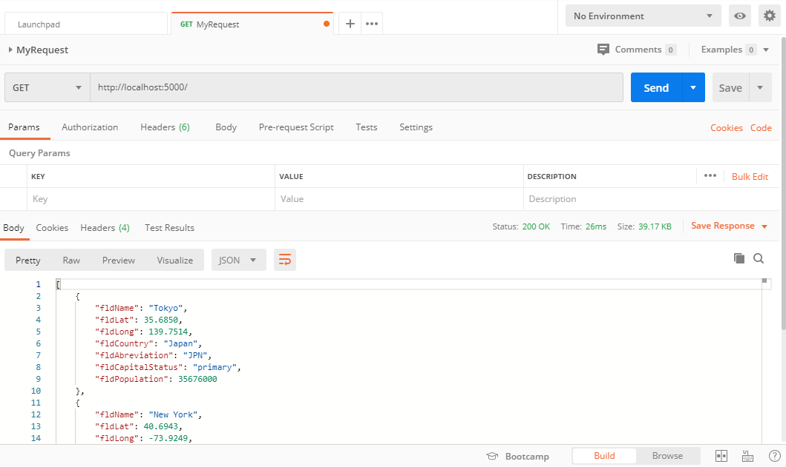
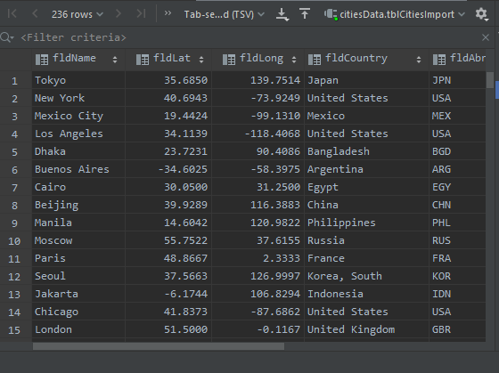
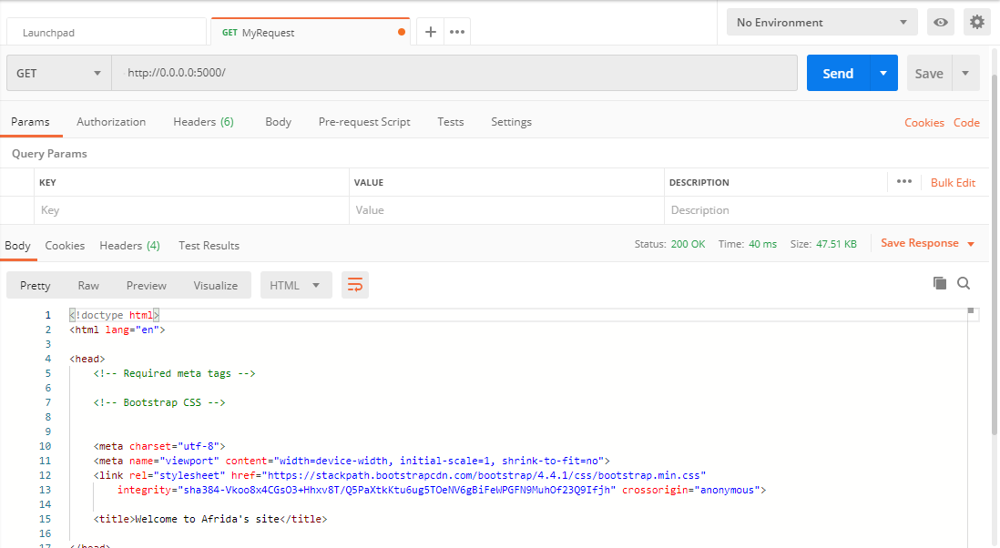
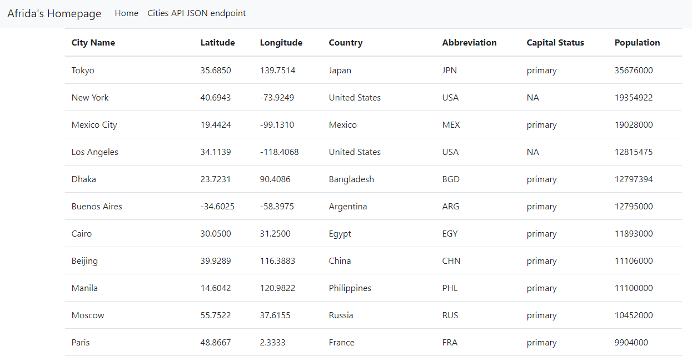

# Project Description
This project is a homework assignment to teach how to get Pycharm setup with Docker, Flask, MySQL, and Postman.
Also to teach how to set up html templates for database.

[Download Assignment PDF Here](PPFSQL-Homework.pdf)

Assignment 1: [View Assignment Video Here](https://youtu.be/QbMWNgrfAFg)

Assignment 2: [View Assignment Video Here](https://youtu.be/tylzleJDlkc)

# Postman Screenshot

# SQL Data Screenshot

# 2nd Postman ScreenShot

# Database Screenshot
